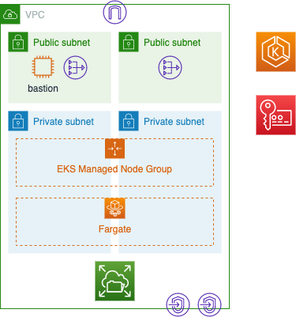

- [EKS構成](#eks構成)
  - [EKS](#eks)
  - [EKS Managed Node Group](#eks-managed-node-group)
  - [Fargate](#fargate)
  - [Network](#network)
  - [EFS](#efs)
  - [KMS](#kms)

# EKS構成

本レポジトリのTerraformで作成するEKS構成について説明します。
全体像は以下の通りです。

## EKS

EKSクラスターを1つ作成します。
作成するEKSクラスターの設定は以下の通りです。

- API Serverへは任意のCIDRからアクセスを許可
- 以下のログをCloudWatchに保存
  - api
  - audit
  - authenticator
  - controllerManager
  - scheduler
- KMSによるEKS内に保存するSecretの暗号化を有効

## EKS Managed Node Group

Podを動かすEC2タイプのノードグループを作成できます。
ノードグループで作成するEC2のスペック（マシンタイプ、ディスク容量）を任意に設定できます。

## Fargate

Podを動かすFargateタイプのプロファイルを作成できます。
Fargateで動かすNamespaces、Podのタグを任意に設定できます。

## Network

以下のネットワークを作成します。

- 任意のリージョンにVPCを作成する
- 2つの異なるAZにパブリックサブネットとプライベートサブネットを2つずつ作成する
- インターネットゲートウェイを作成する
- 各パブリックサブネットにNATゲートウェイを作成し、プライベートサブネットからもインターネットアクセス可能にする
- ECRおよびS3へプライベートアクセスするためのエンドポイントを作成する

## EFS

Pod間の共有ボリュームとしてEFSを作成できます。
EFSは任意のアクセスポイントを作成することもできます。

## KMS

K8sのSecretおよびEFSを暗号化するための鍵を作成します。